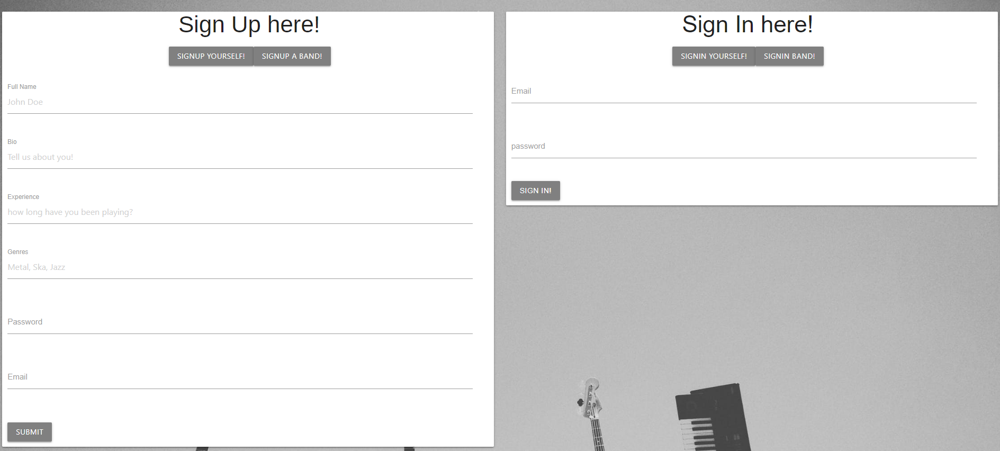

# Bandly App

Deployed Site: [https://upenn2019-project-3.herokuapp.com/](https://upenn2019-project-3.herokuapp.com/)

* Database currently down.

## Description

Bandly is an app that creates a platform for musicians connect.

In a world where there are millions of musicians, there are few websites that is dedicated towards Musicians to connect. Website that do this are general connection sites like craigslist or are paid services.

Bandly is a free app that focues on the connection of Musicians. Helping Musicians to find bands and vice versa. 

## Technologies Used

* React.js - Used to render the components on the html pages

* Express - back end server and routing

* MySQL + Sequelize - Database and orm

* React-materialize - css library

* Passport - User Authentication

* Socket.io - Live messaging

* Firebase - Audio and Image file uploads

## Site Overview

Home Page, featuring some members and bands, also has a search form to find other users and begin connecting

Login form where users can sign up as a band or as a musician.

Profile page of users allowing them to add profile images and music representing themselves

A instant messaging feature within the website

A post, newsfeed page for people to know whats going on in the world of musicians

## Future site developments

* More features to message.

* More descriptions to a users profile, such as more audio and images.

* Virtual Auditions to better help users find the right member for their bands.

* Follow system such as twitters, social media element make connections more engaing.

* Front-end polishing.

* Fixing uploading

